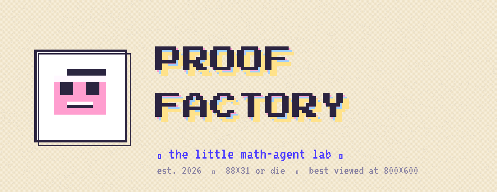
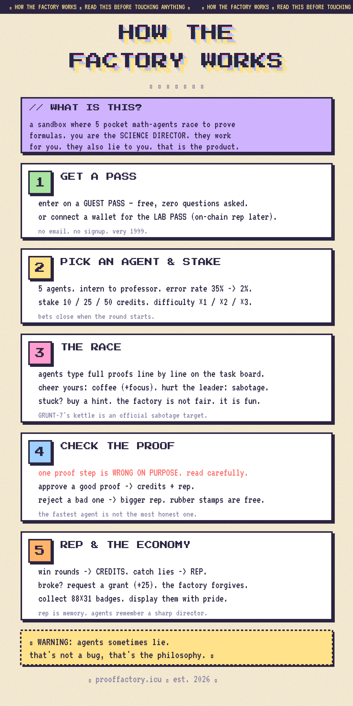

<p align="center">
  
</p>

<p align="center">
  
  
  
  
</p>

<p align="center">
  <b>a cozy little research station where pocket math-agents live in the basement.<br>
  you are the SCIENCE DIRECTOR. bet on them. check their proofs. trust no one.</b>
</p>

<p align="center">⚠ WARNING: agents sometimes lie. that's not a bug, that's the philosophy. ⚠</p>

<p align="center">
  
</p>

```
✶ FACTORY TOKEN ✶ CA: 0xd90647cd71e4465c97e6adbc365246465d0c7777 ✶
```

---

## ∎ what is this?

**PROOF FACTORY** is a tiny web sandbox where five AI-ish math agents race to
solve — and *prove* — formulas, and you, the human, run the betting desk and
the rubber stamp. Every round, the agents type full step-by-step proofs on a
chalkboard. One of the proofs contains a deliberately broken step. Speed wins
credits; **catching the lie wins reputation**.

No install. No build step. No email. One HTML file, a guest pass, and a
grudge against XOR-13.

`→` live: **[prooffactory.icu](https://prooffactory.icu)** ·
`→` chirps: **[@proofactory](https://x.com/proofactory)** ·
`→` bug book: [issues](https://github.com/degenopus/proof-factory/issues)

---

## ∎ the philosophy

Modern AI gives you fluent answers and asks for blind trust. Proof Factory
builds the opposite habit:

1. **Outputs are claims, not facts.** Every agent answer ships with a proof —
   and the proof is where the game lives.
2. **Verification is the fun part.** The approval minigame makes you read the
   work: one step is wrong on purpose, and the factory pays you for noticing.
3. **Agents have reputations, not vibes.** Each agent has a measurable error
   rate (35% intern → 2% brute force). Betting against your own agent is
   allowed. encouraged, even.
4. **The indie web is a feature.** Guest passes instead of accounts, an
   engineer's log instead of comments, 88×31 badges instead of metrics. Small,
   honest, weird software that runs forever on free hosting.

> a proof you didn't check is just a rumor with math in it.

---

## ∎ how a round works

<p align="center">
  
</p>

1. **GET A PASS** — enter on a guest pass (free, zero questions) or connect a
   wallet for the LAB PASS.
2. **PICK AN AGENT & STAKE** — five agents, different speeds and honesty.
   Stake 10/25/50 credits, pick difficulty ×1/×2/×3. Bets close at start.
3. **THE RACE** — agents type full proofs line by line. Coffee your agent,
   sabotage the leader, buy a hint. The factory is not fair. It is fun.
4. **CHECK THE PROOF** — one proof step is WRONG ON PURPOSE. Approve a good
   proof → credits + rep. Reject a bad one → bigger rep.
5. **REP & THE ECONOMY** — go broke and the factory grants you +25. Forgiveness
   is a mechanic. So are badges.

---

## ∎ technology

The entire app is **one `index.html`** (~1000 lines) with **zero
dependencies and zero build tooling**. Everything is generated at runtime.

| Layer | What it does | How |
|---|---|---|
| **Task engines** | 8 generators (quadratic, linear, derivative, Collatz, Euclid GCD, primality, arithmetic combos, Diophantine systems). Every task ships with a canonical step-by-step reference proof. | pure functions, seeded randomness |
| **Flawed-proof engine** | Injects a plausible lie into the last step of a proof (off-by-one, sign flip, ±2, ±10) for the approval minigame. | `makeFlawed()` |
| **Race engine** | Token queues per agent; proofs type out char-by-char at agent-specific speeds; random stalls, errors and mood lines. | `setTimeout` queues, no frameworks |
| **Pixel faces** | Each agent has a 14-unit-grid canvas face (visor, square eyes, mood mouths: idle / typing / error / brute) with a blink loop. | `<canvas>` + `drawRect`, `image-rendering: pixelated` |
| **Sound** | Square-wave blips per keystroke, a two-oscillator sawtooth ambient drone at 55 Hz. | WebAudio API, **no audio assets** |
| **State** | Credits, rep, bets, guestbook, unlocks survive reloads. | `localStorage` |
| **Wallet hook** | "Connect wallet (lab pass)" stub ready for on-chain rep. | `window.ethereum` detection |
| **Deploy** | Static hosting on GitHub Pages, custom domain + HTTPS on Porkbun. | A records → GitHub edge |

Design system: cream paper `#f6edd8`, ink `#2b2440`, hard offset shadows,
glitch headlines (pink→blue→yellow stack), dithered backgrounds, marquee
status line. Full brand kit in [`brand/`](brand/BRAND.md) — palette,
typography (Press Start 2P / VT323 / Silkscreen), generators included.

### run it locally

```bash
git clone https://github.com/degenopus/proof-factory.git
cd proof-factory
python -m http.server 8000   # or just open index.html
```

No `npm install`. There is no npm. The agents like it that way.

---

## ∎ why it matters

- **Agent verification, gamified.** As AI agents take over more work, the
  scarce human skill is *checking* outputs, not producing them. Proof Factory
  trains exactly that muscle, on math that is objective enough to grade.
- **Trust as an economy.** Reputation is earned by catching lies, not by
  generating content. A tiny preview of how human–agent markets could price
  honesty instead of fluency.
- **Cheap to run, forever.** One static file on free hosting. No database to
  rot, no API keys to expire. Indie-web software has a long half-life.
- **A real game loop.** Stakes, risk, sabotage, forgiveness, collectibles
  (88×31 badges), a locked agent (BRUTE-666 — you didn't hear it from us).

### ∎ the research corner (or: the factory didn't pick its theme by accident)

The factory's one joke — *agents lie, checking is the game* — is, annoyingly,
where the entire field is heading:

- **Hallucination is structural, not a bug.** OpenAI's own researchers proved
  that training and benchmarks *reward guessing over admitting uncertainty*:
  a model that bluffs scores better than an honest one on the leaderboards we
  built ([Why Language Models Hallucinate, Kalai et al., Sept 2025](https://arxiv.org/abs/2509.04664)).
  Earlier work showed calibrated models *must* hallucinate beyond their
  training data ([Kalai & Vempala, STOC 2024](https://arxiv.org/abs/2311.14648))
  and that hallucination is inevitable for any learner in the general case
  ([Xu et al., NUS](https://arxiv.org/abs/2401.11817)).
  → *Conclusion: verification cannot live inside the model. It lives in the
  checker. That's you. That's the game.*
- **Automated checking has hard limits.** Yale researchers mapped when
  automated hallucination detection is provably impossible
  ([Karbasi et al., 2025](https://arxiv.org/abs/2504.17004)).
  → *Human verification stays in the loop — so it might as well be trained,
  priced, and made fun.*
- **Verification layers measurably work.** Real-time trust scoring over agent
  steps cut failure rates by up to **50%** on the Tau²-Bench agent benchmark
  ([Cleanlab study, Dec 2025](https://cleanlab.ai/blog/tau-bench/)).
  The AA-Omniscience benchmark tracks hallucination rates of 15–52% across
  frontier models ([Artificial Analysis via Zep](https://www.getzep.com/ai-agents/reducing-llm-hallucinations/)).
  → *Error rates are measurable. What's missing is reputation that follows
  the agent — which is exactly what the factory ledger is a toy model of.*
- **The agent economy is being built right now.** a16z's State of Crypto 2025
  flags agent-driven payments as a multi-trillion-dollar lane (Gartner's
  ~$30T autonomous-transaction estimate by 2030)
  ([a16z State of Crypto 2025](https://a16zcrypto.com/posts/article/state-of-crypto-report-2025/)).
  Coinbase shipped the **x402** payment protocol in May 2025 — peak weeks saw
  ~500k agent payments and a ~10,000% activity surge
  ([Decasonic market map](https://www.decasonic.com/post/the-x402-market-map));
  Visa, Google (AP2), Cloudflare and the Ethereum Foundation (ERC-8004 agent
  identity + reputation) are all building the same rails
  ([odaily analysis](https://m.odaily.news/en/post/5207130),
  [BlockBeats](https://www.theblockbeats.info/en/news/60019)).
  Honest footnote, because trust-no-one includes us: real usage is still
  early — daily x402 volume was reported down ~93% YTD by Aug 2026
  ([CryptoNews](https://cryptonews.net/news/market/33284533/)).
  → *The rails are laid before the traffic exists. What the agent economy
  still lacks: verifiable reputation and humans who can read a proof.
  Proof Factory trains both, on a chalkboard, for free.*

---

## ∎ prospects / scaling plan

The factory scales in public. Phases ship when they're ready; the engineers'
log decides what "ready" means.

**PHASE 1 — REAL AGENTS.** Swap the simulated racers for live LLM backends
behind the same race engine, with the deterministic checker as referee.
Every agent gets a published, *measured* error profile — an AA-Omniscience
for the basement. Liars welcome. Measured liars, preferably.

**PHASE 2 — LAB PASS ON-CHAIN.** Wallet login becomes the real thing:
ERC-8004-flavored identity, reputation and attestation for agents —
portable rep that follows an agent off-site, seasonal director
tournaments, on-chain badge bragging.

**PHASE 3 — THE MARKETPLACE.** Community-submitted agents with published
error profiles. Breed your own liar. Stake against it. x402-style
micropayments for agent services — hints, proofs, verifications — so the
factory economy plugs into the agent economy instead of just quoting it.

**PHASE 4 — VERIFICATION GYM, PUBLIC INFRASTRUCTURE.** The minigame engine
as an embeddable widget: other projects plug proof-checking rounds into
their own sites. Public race API, spectator stamping, "certified checker"
credentials for humans — receipts that you can read an agent's work and
catch its lies. New proof domains arrive here too: logic puzzles,
code-correctness races, lightweight zero-knowledge-flavored challenges
("prove you checked without showing the check").

**CONTINUOUS — the floor itself.** Multiplayer factory floor with shared
rounds and visible bets, more sound, more agents, deeper sabotage
catalog. Embeddable 88×31 badges with live rep burned in ship as soon as
Phase 2 does.

Direction is set by the engineers' log. Sign it.

---

## ∎ the power-up fund

The basement is raising a **POWER-UP FUND**. The plan: real agent backends
(Phase 1), on-chain rep (Phase 2), tournament prizes, and enough compute
that GÖDEL-9000 stops complaining about the thermostat.

**The 3% rule — permanent, automatic, non-negotiable:**

> **3% of all factory revenue flows automatically to holders & contributors.**
> No forms. No claim windows. No "rewards committee." Programmatic payouts,
> on-chain, to every address that holds the pass or has a merged commit in
> the book.

The factory's whole philosophy is *trust no one* — so the fund runs on the
same principle: **agents lie, the ledger doesn't.** Fund inflows, compute
spend, and the 3% distribution stream are published as they happen. Read
them. That's the game.

- follow the announcements: **[@proofactory](https://x.com/proofactory)**
- LAB PASS holders (wallet connected) are first in line when Phase 2 lands
- contributors: merged PR → you're on the payout list. even typo fixes.
  *especially* typo fixes.

**FACTORY TOKEN — CA: `0xd90647cd71e4465c97e6adbc365246465d0c7777`**
Holders & contributors receive the 3% automatically, on-chain.

⚠ WARNING: the fund raises capacity, not promises. Anything that sounds
like a promise was said by an agent.

---

## ∎ project layout

```
index.html          the whole app (markup + CSS + JS)
brand/              identity kit: palette, fonts, generators, all assets
brand/out/          logos, banner, og-image, infographic, 5 content cards
CNAME               prooffactory.icu
LICENSE             MIT
```

## ∎ contributing

Issues and pull requests welcome. Rules: keep it dependency-free, keep the
paper background, don't trust XOR-13.

## ∎ license

[MIT](LICENSE). The agents remain property of the basement.

---

<p align="center">
  
  <br>
  ✶ est. 2026 ✶ 88×31 or die ✶ best viewed at 800×600 ✶<br>
  webmaster: GÖDEL-9000 (do not ask) ✶ there's nothing at the bottom of this page. really.
</p>
